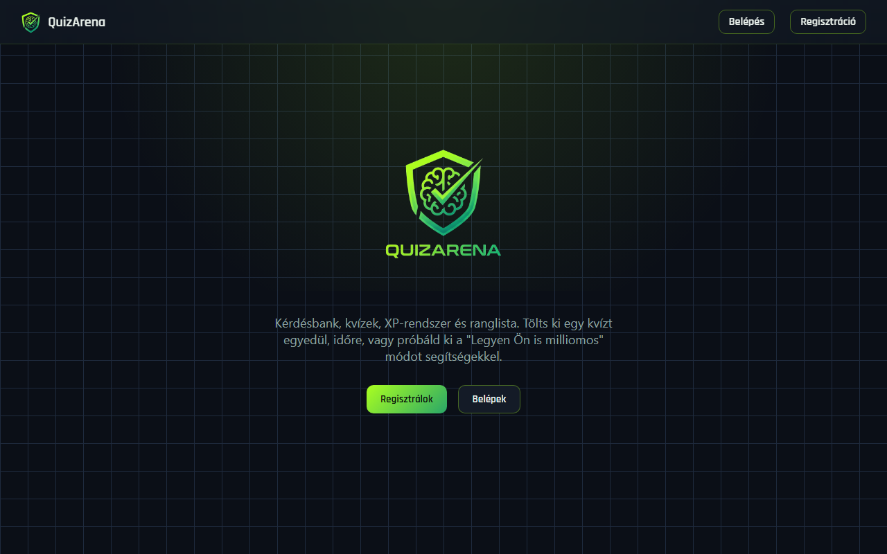
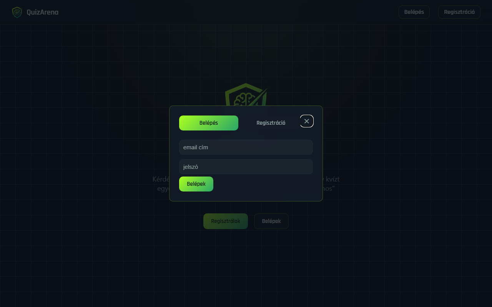
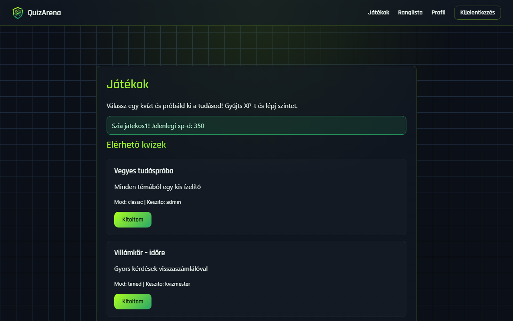
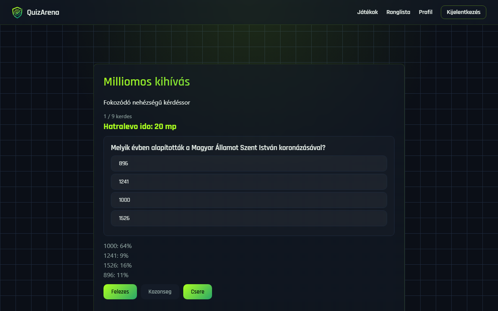
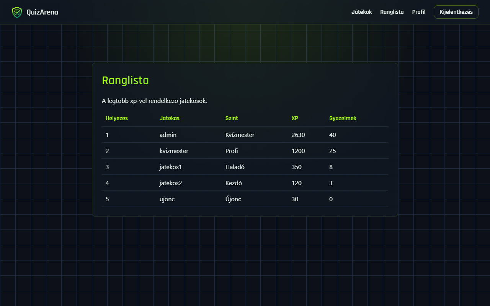
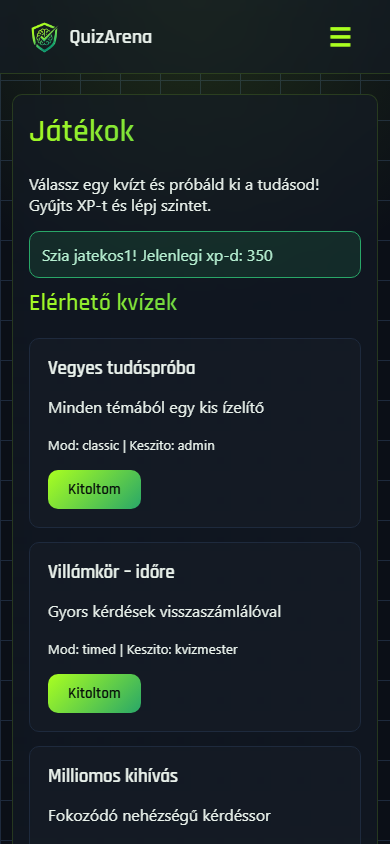

<div align="center">



# QuizArena

**Kvízplatform XP-rendszerrel, ranglistával és három különböző játékmóddal**

</div>

---

## Miről szól ez a projekt

A QuizArena egy böngészőben futó kvíz- és vetélkedő-alkalmazás: a felhasználók
regisztrálnak, kvízeket töltenek ki, XP-t gyűjtenek, szintet lépnek, és
versenyeznek egymással a ranglistán. A cél az volt, hogy egy egyszerű
kvízjáték köré egy tényleg jól használható, modern felületet és egy
becsületesen szerveroldalon számolt, csalásbiztos pontrendszert építsünk.

A backend Node.js + Express + SQLite, a frontend natív HTML/CSS/JavaScript,
build-lépés és frontend framework nélkül.

## Képernyőképek

<table>
<tr>
<td width="50%">

<p align="center"><sub>Belépés és regisztráció egy felugró ablakban</sub></p>
</td>
<td width="50%">

<p align="center"><sub>Bejelentkezés után elérhető kvízek</sub></p>
</td>
</tr>
<tr>
<td width="50%">

<p align="center"><sub>"Legyen Ön is milliomos" mód: időzítővel és segítségekkel</sub></p>
</td>
<td width="50%">

<p align="center"><sub>Ranglista a legjobb játékosokkal</sub></p>
</td>
</tr>
</table>

<div align="center">

<p><sub>A felület mobilon is használható</sub></p>
</div>

## Funkciók

**Fiókkezelés**
- Regisztráció, bejelentkezés, kijelentkezés egy felugró ablakban, oldalváltás nélkül
- A főoldal egy bemutatkozó (hero) felület; a kvízek, a ranglista és a profil
  csak bejelentkezve érhető el

**Három játékmód**

| Mód | Hogyan működik |
|---|---|
| Klasszikus | Az összes kérdés egyszerre látszik, nincs időnyomás |
| Időre menő | A kérdések egyesével jönnek, 20 másodperc jár mindegyikre; ha lejár az idő, a rendszer automatikusan továbblép, és az adott kérdés rossz válasznak számít |
| Legyen Ön is milliomos | Egyesével, nehezedő sorrendben jönnek a kérdések, mindegyik időre megy. Egy rossz válasz azonnal véget vet a játéknak, viszont minden 5. helyes válasz után külön XP-bónusz jár. Háromféle segítség vethető be egyszer-egyszer: **felezés**, **közönség szavazata** és **kérdéscsere** |

**Pontozás és haladás**
- Helyes válasz a kérdés pontját éri (időre menő módban idő-bónusszal is), rossz
  válasz viszont pontlevonással jár — a végeredmény ettől függetlenül sosem
  megy 0 alá
- A pontszámítás és a helyes válasz ellenőrzése kizárólag szerveroldalon
  történik; a böngésző a kérdés kitöltése előtt sosem kapja meg, melyik a
  helyes válasz
- A kérdések és a válaszlehetőségek sorrendje minden kitöltéskor újrakeveredik
- XP- és szintrendszer, valamint egy XP alapú ranglista
- Profil oldal a saját statisztikákkal és a korábbi eredményekkel (pontszám,
  helyes válaszok, ráfordított idő)

## Technológiák

- **Backend:** Node.js, Express, better-sqlite3
- **Adatbázis:** SQLite
- **Frontend:** natív HTML, CSS és JavaScript (framework és build-lépés nélkül)
- **Tesztelés:** Node.js beépített `node:test` futtatója

## Gyors indítás

```bash
npm install
npm run seed
npm start
```

Ezután nyisd meg a `http://localhost:3000` címet böngészőben.

> Az adatbázis-fájl nincs a repóban (mert játék közben folyamatosan
> változna), ezért kell előtte az `npm run seed` — ez felépíti és feltölti
> kérdésekkel, kvízekkel és néhány teszt-felhasználóval.
>
> Az `npm run seed` csak akkor fut le, ha a szerver éppen nem fut (a
> Windows zárolja a fájlt futás közben) — előbb állítsd le `Ctrl+C`-vel,
> utána futtasd a seedet, majd indítsd újra a szervert.

### Teszt fiókok

| Email | Jelszó | Szerepkör |
|---|---|---|
| admin@quizarena.hu | admin123 | admin |
| host@quizarena.hu | host123 | host |
| anna@example.com | jelszo1 | player |
| bela@example.com | jelszo2 | player |
| cili@example.com | jelszo3 | player |

### Automata tesztek

```bash
npm test
```

A `server/utils/scoring.js` pontszámító és XP-logikáját fedik le egységtesztek.

## Projekt szerkezete

```
quizarena/
├── server/                 # backend (Node.js + Express)
│   ├── app.js               # a szervert indító fájl
│   ├── config/db.js         # adatbázis-kapcsolat
│   ├── routes/               # API végpontok (auth, kérdések, kvízek, játék, ranglista, felhasználók)
│   ├── middleware/           # bejelentkezés-ellenőrzés
│   └── utils/scoring.js      # pontszámítás és XP-logika
├── public/                 # frontend
│   ├── index.html            # főoldal / hero
│   ├── games.html            # kvízlista
│   ├── quiz.html             # egy kvíz kitöltése
│   ├── leaderboard.html      # ranglista
│   ├── profile.html          # profil
│   ├── css/style.css         # stíluslap
│   └── js/
│       ├── layout.js         # közös navigáció és a belépő ablak
│       ├── games.js          # kvízlista logika
│       ├── quiz.js           # kvíz kitöltése, időzítő, milliomos mód
│       ├── leaderboard.js
│       └── profile.js
├── db/                      # adatbázis-séma és feltöltő szkript
├── tests/                   # automata tesztek
└── docs/                    # tervdokumentumok, képernyőképek
```

## Háttér

Ez a projekt a Programfejlesztő és tesztelő felnőttképzés vizsgaremekeként
készült, egy csapattárssal közösen. Emiatt néhány döntés tudatosan az
egyszerűség felé billen a "production-ready" megoldások helyett — például a
jelszavak SHA-256 hasheléssel vannak tárolva bcrypt helyett, és a csapatos
játékmód alapjai megvannak az adatbázisban, de a funkció még nincs kész.
